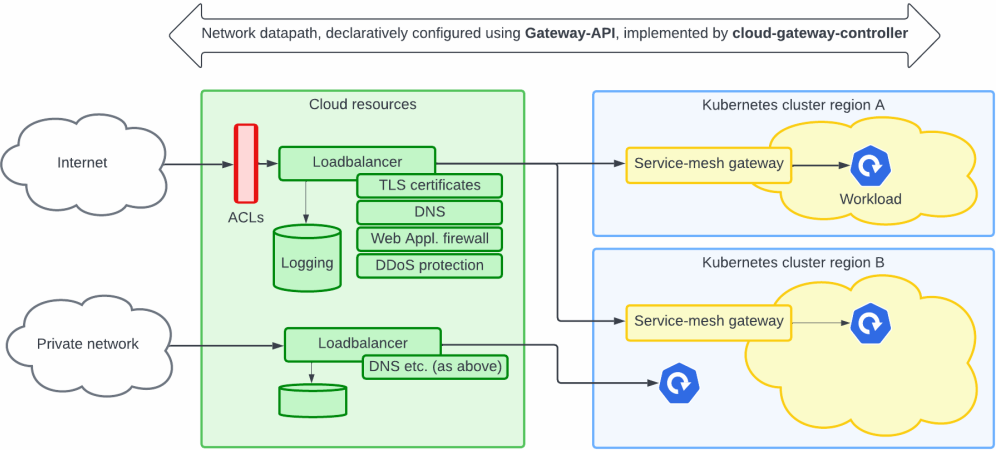
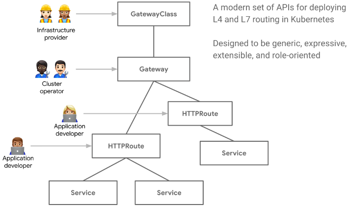

# Cloud Gateway Controller

The cloud-gateway-controller is an augmented Kubernetes network
gateway-controller -- think of it as a Kubernetes ingress-controller
that not only provides a data-path inside Kubernetes, but extends the
data-path outside Kubernetes into the surrounding cloud
infrastructure.

## End-to-end Network Path

A typical gateway/ingress controller for Kubernetes implements a
datapath inside Kubernetes, e.g. a Kubernetes `Deployment`,
`HorizontalPodAutoscaler` and `Service`. The `Service` may be of type
`LoadBalancer` which could result in a load-balancer service being
allocated from the surrounding cloud infrastructure.

However, there are several other concerns that impacts the network
datapath at the edge of the infrastructure:

- DNS. Ensuring that traffic are routed to our network datapath based
  on DNS lookups.

- TLS certificates bound to the DNS name(s) of the network datapath.

- Network connectivity, e.g. should the datapath be generally exposed
  to the internet or potentially internal subnets without public
  connectivity.

- ACLs limiting access to public datapaths based on IP addresses.

- Adaptive and 'deep inspection' type of filtering and protection -
  'web application firewall' solutions.

- Logging of network traffic.

- Load-balancer type, e.g. we may want to use an 'AWS application
  (ALB)' load balancer for some datapaths and an 'AWS API gateway' for
  others (an AWS API gateway is a server-less solution whereas an ALB
  is a 'running instance' type of solution with a non-zero idle-load
  cost).

- Multi-cluster and multi-region load balancing and traffic routing.

Similarly, inside the Kubernetes cluster, we may have services that
need a full service-mesh while others do not.

A possible network datapath can thus look like this:

> 

## Using the Kubernetes Gateway API

When building a platform, it is essential to provide a well-designed
API to abstractions that are useful and manageable to users. The
cloud-gateway-controller implements the [Kubernetes Gateway
API](https://gateway-api.sigs.k8s.io/) to achieve this objective.

The [Kubernetes Gateway API](https://gateway-api.sigs.k8s.io/) is an
API for describing network gateways and configure routing from
gateways to Kubernetes services. This API is fast becoming the
standard API and is [widely
supported](https://gateway-api.sigs.k8s.io/implementations/).

xxx

A side-effect of using the Gateway API is that the
cloud-gateway-controller interoperate well with other Kubernetes
solutions that automate networking, e.g. Canary deployments using
[Flagger](https://flagger.app).

## User Journeys

One of the principles driving the Gateway API was to support multiple
personas, i.e. design an API that has Kubernetes resources for each
persona. See e.g. the following example:

> 
(source: https://gateway-api.sigs.k8s.io/)

In the following we describe how to use the cloud-gateway-controller
as seen from the perspective of these personas.

- [Basic Network Datapath](doc/basic-datapath.md)
- Configuring a Datapath through a GatewayClass Definition
