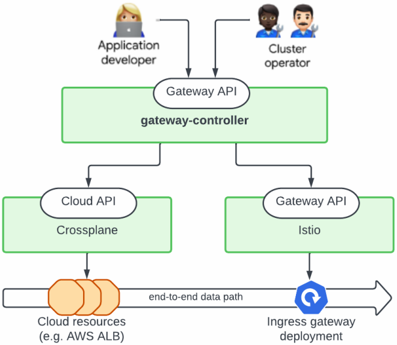

# Cloud Gateway Controller

The *cloud-gateway-controller* is an augmented Kubernetes network
gateway-controller -- think of it as a Kubernetes ingress-controller
that not only provides a data-path inside Kubernetes, but extends the
data-path outside Kubernetes into the surrounding cloud
infrastructure.

## End-to-end Network Path

A typical gateway/ingress controller for Kubernetes implements a
datapath inside Kubernetes, e.g. a Kubernetes `Deployment`,
`HorizontalPodAutoscaler` and `Service`. The `Service` may be of type
`LoadBalancer` which could result in a load-balancer service being
allocated from the surrounding cloud infrastructure.

However, there are several other concerns that impacts the network
datapath at the edge of the infrastructure:

- DNS. Ensuring that traffic are routed to our network datapath based
  on DNS lookups.

- TLS certificates bound to the DNS name(s) of the network datapath.

- Network connectivity, e.g. should the datapath be generally exposed
  to the internet or potentially internal subnets without public
  connectivity.

- ACLs limiting access to public datapaths based on IP addresses.

- Adaptive and 'deep inspection' type of filtering and protection -
  aka. 'web application firewall' solutions.

- Logging of network traffic.

- Load-balancer type, e.g. we may want to use an 'AWS application
  (ALB)' load balancer for some datapaths and an 'AWS API gateway' for
  others (an AWS API gateway is a server-less solution whereas an ALB
  is a 'running instance' type of solution with a non-zero idle-load
  cost).

- Multi-cluster and multi-region load balancing and traffic routing.

Similarly, inside the Kubernetes cluster, we may have services that
need a full service-mesh while others do not.

The following is two examples of network datapaths:

## Using the Kubernetes Gateway API

When building a platform, it is essential to provide a well-designed
API to abstractions that are useful and manageable to users. The
*cloud-gateway-controller* implements the [Kubernetes Gateway
API](https://gateway-api.sigs.k8s.io/) to achieve this objective.

The [Kubernetes Gateway API](https://gateway-api.sigs.k8s.io/) is an
API for describing network gateways and configure routing from
gateways to Kubernetes services. This API is fast becoming the
standard API and is [widely
supported](https://gateway-api.sigs.k8s.io/implementations/).

**The *cloud-gateway-controller* presents the gateway API to users as
the sole interface for network datapath definition.** This is the only
interface users need to know and it fully supports a GitOps-based
workflow. Users do not need to work with Terraform or generally know
how the Gateway API is implemented by the platform.

The Gateway API does not cover concerns such as DNS or web application
firewall (WAF) configuration. **The *cloud-gateway-controller*
implements concerns beyond Gateway API scope using configuration in
`GatewayClass` resources.** E.g., a specific `GatewayClass` defines a
specific set of WAF rules.  This is very similar to how Kubernetes
[storage
classes](https://kubernetes.io/docs/concepts/storage/storage-classes)
map abstract storage claims to actual implementations.

A side-effect of using the Gateway API is that the
*cloud-gateway-controller* interoperate well with other Kubernetes
solutions that automate networking, e.g. Canary deployments using
[Flagger](https://flagger.app).

## The *cloud-gateway-controller* is a Controller-of-controllers

The *cloud-gateway-controller* does not talk to any cloud-APIs to
implement the datapath. Instead it creates other Kubernetes resources
that implement the individual components - much like the Kubernetes
Deployment controller creates Pod resources and let another
controller implement Pod resources.

**One can think of the *cloud-gateway-controller* as an advanced Helm
chart or a Crossplane composition.**

Because the *cloud-gateway-controller* implements cloud resources
through other controllers and with resources configured through
`GatewayClass` resources, the *cloud-gateway-controller* is
cloud-agnostic (but `GatewayClass` definitions are not).

Similarly, the *cloud-gateway-controller* does not create datapaths
inside Kubernetes, e.g. the *service mesh gateway* shown in the image
above. These parts of the datapath are implemented by traditional
gateway controllers such as Istio, Contour etc.

The overarching purpose of the *cloud-gateway-controller* is to
orchestrate the Kubernetes external and internal datapaths and this
complete datapath is configured using the Gateway API. This is
illustrated below using Crossplane for managing cloud resources and
Istio for managing the Kubernetes-internal datapath.

### Why Not Use e.g. Crossplane or Helm?

An important objective of the *cloud-gateway-controller* is to maintain
a Gateway API compatible interface towards users. This would not be
possible with techniques such as Crossplane and Helm.  Also, the
mapping from the Gateway API to e.g. a Crossplane composition is
non-trivial, i.e. it is difficult to do with purely templating.

The *cloud-gateway-controller* implements some of the same composition
logic as e.g. Crossplane. Why did we not use Crossplane compositions,
e.g. build a Gateway API implementation using the following hierarchy
of services?

- Cloud-gateway-controller implements facade gateway API, stamps out Crossplane claim
- Crossplane implements claim towards a composition
- Composition defines how low-level cloud resources should be stamped out
- Crossplane AWS provider implements low-level resources towards cloud API

While this would be feasible, there are several complicated
dependencies between each of the above components, which increase the
maintenance burden. The *cloud-gateway-controller* design aims at
reducing the complexity by building on a more self-contained
monolithic design - or at least a design with less advanced
dependencies between components. For this reason, we use the basic,
low-level cloud resources of e.g. Crossplane and not the higher-level
composition functionality.

## User Journeys

One of the principles driving the Gateway API was to support multiple
personas, i.e. design an API that has Kubernetes resources for each
persona. See e.g. the following example:

(source: https://gateway-api.sigs.k8s.io/)

In the following we describe how to use the *cloud-gateway-controller*
as seen from the perspective of these personas.

- [Basic Network Datapath](doc/basic-datapath.md)
- Configuring a Datapath through a GatewayClass Definition
