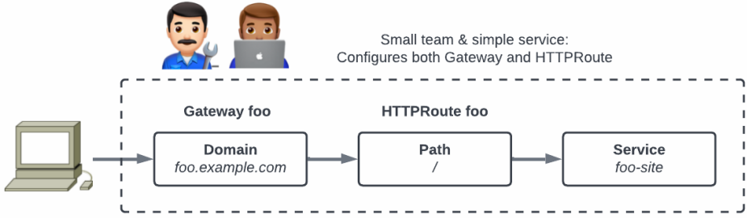

# Basic Network Datapath for Small Team

This document describe user actions necessary to create a basic
datapath for a 'small team'. The team is considered 'small' because
they deploy a single Kubernetes Service and they manage both `Gateway`
and `HTTPRoute` resources themselves, i.e. this applies to an **SRE**
and **developer** persona.

The team will host their service on the domain `foo.example.com` and
HTTP traffic will be routed to the `foo-site` Kubernetes service as
shown below.


(source: https://gateway-api.sigs.k8s.io/)

To achieve this, the SRE/developer persona needs to:

- Create a `Gateway` resource that specify the domain name and the protocol used.
- Choose a `GatewayClass` for the `Gateway` that results in public
  reachability of the gateway. The available `GatewayClass`es and
  their characteristics will be available from platform documentation.
- Create an `HTTPRoute` resource that route traffic from the gateway to the `foo-site` Kubernetes service.

Prior to this, a cluster operator persona have configured the
`GatewayClass` named `public-class` such that gateways using this
class results in public reachability.

The team SRE/developer persona creates a `Gateway` resource as
follows:

```yaml
apiVersion: gateway.networking.k8s.io/v1beta1
kind: Gateway
metadata:
  name: foo-gateway
spec:
  gatewayClassName: public-class
  listeners:
  - name: web
    port: 80
    protocol: HTTP
    hostname: "foo.example.com"
```

Additionally, the team SRE/developer persona define routing from the
gateway to the `foo-site` Kubernetes service with the following
`HTTPRoute` resource:

```yaml
apiVersion: gateway.networking.k8s.io/v1beta1
kind: HTTPRoute
metadata:
  name: foo-site
spec:
  parentRefs:
  - kind: Gateway
    name: foo-gateway
  rules:
  - backendRefs:
    - name: foo-site
      port: 80
```

With these two resources, the datapath illustrated above will be
created by the *bifrost-gateway-controller* and the 'small team'
SRE/developer persona do not need to perform any additional actions.

## Implementation by *bifrost-gateway-controller*

The definitions above are generic Gateway API definitions. To
illustrate how the *bifrost-gateway-controller* implements this datapath
we will assume the `GatewayClass` specified (`public-class`)
defines an implementation with an Istio service-mesh inside Kubernetes
and ingress through an Istio ingress-gateway. Additionally we assume
an AWS cloud infrastructure managed through Crossplane. To simplify
the illustration some presented resources will have non-essential
information left out.

Note, that using Crossplane to provision the AWS load balancer may be
over-kill for this simple example. However, examples that use more
advanced cloud features will require an implementation that provide
the level of control that e.g. Crossplane allows. Multi-cluster load
distribution being one example of this.

### Creating Istio Ingress Gateway

To create the Istio ingress-gateway, the *bifrost-gateway-controller*
create a copy of the `foo-gateway` `Gateway` resource specifying an
`istio` class instead of `public-class`:

```yaml
apiVersion: gateway.networking.k8s.io/v1beta1
kind: Gateway
metadata:
  name: foo-gateway-istio       # Suffixed to avoid name conflict
spec:
  gatewayClassName: istio       # Note, different class name
  listeners:
  - name: web
    port: 80
    protocol: HTTP
    hostname: "foo.example.com"
```

Since Istio [also implements the Gateway
API](https://istio.io/latest/docs/tasks/traffic-management/ingress/gateway-api)
(albeit with a scope limited to the Kubernetes cluster) the result
will be a Kubernetes `Deployment` and `Service` named
`foo-gateway-istio`. This implements the Kubernetes-internal part of
the datapath.

Similarly, a copy is created of the `HTTPRoute` to configure the Istio
gateway. Note, that the gateway reference in `parentRefs` is changed
to the Istio gateway:

```yaml
apiVersion: gateway.networking.k8s.io/v1beta1
kind: HTTPRoute
metadata:
  name: foo-site-istio       # Suffixed to avoid name conflict
spec:
  parentRefs:
  - kind: Gateway
    name: foo-gateway-istio  # Configure routing in the Istio gateway
  rules:
  - backendRefs:
    - name: foo-site
      port: 80
```

### Creating Cloud Load Balancer

The cloud infrastructure resources are provisioned through Crossplane
using basic AWS resources. For this example, the `GatewayClass`
`public-class` define an AWS ALB based network path exposed
to the Internet through public subnets. Thus, the
*bifrost-gateway-controller* creates the AWS ALB using the following
resources. Note how the port and protocol are propagated from the
`Gateway` resource to the `Listener` resource:

```yaml
apiVersion: elbv2.aws.crossplane.io/v1alpha1
kind: LoadBalancer
metadata:
  name: foo-gateway
spec:
  forProvider:
    subnetMappings:
    - subnetID: public-subnet-1
    - subnetID: public-subnet-2
    - subnetID: public-subnet-3
---
apiVersion: elbv2.aws.crossplane.io/v1alpha1
kind: TargetGroup
metadata:
  name: foo-gateway
spec:
  forProvider:
    protocol: HTTP
---
apiVersion: elbv2.aws.crossplane.io/v1alpha1
kind: Listener
metadata:
  name: foo-gateway
spec:
  forProvider:
    port: 80
    protocol: HTTP
    loadBalancerArn: <inserted by bifrost-gateway-controller when known>
    defaultActions:
    - actionType: forward
      targetGroupArn: <inserted by bifrost-gateway-controller when known>
```

Note, that in the above resource, there are inter-resource
references. These will be filled out by the controller as they become
known. Also, the `GatewayClass` may have been configured with some
static values, e.g. the subnet IDs above.

The final link between the `TargetGroup` created above and the Istio
ingress-gateway Pods is the following `TargetGroupBinding`. This
resource is managed by the [AWS load balancer
controller](https://kubernetes-sigs.github.io/aws-load-balancer-controller)
and updates the AWS `TargetGroup` with the addresses of the Istio
ingress-gateway Pods.

```yaml
apiVersion: elbv2.k8s.aws/v1beta1
kind: TargetGroupBinding
metadata:
  name: foo-gateway
spec:
  targetGroupARN: <inserted by bifrost-gateway-controller when known>
  targetType: ip
  serviceRef:
    name: foo-gateway-istio    # Load balancer targets are Istio ingress-gw Pods
```
