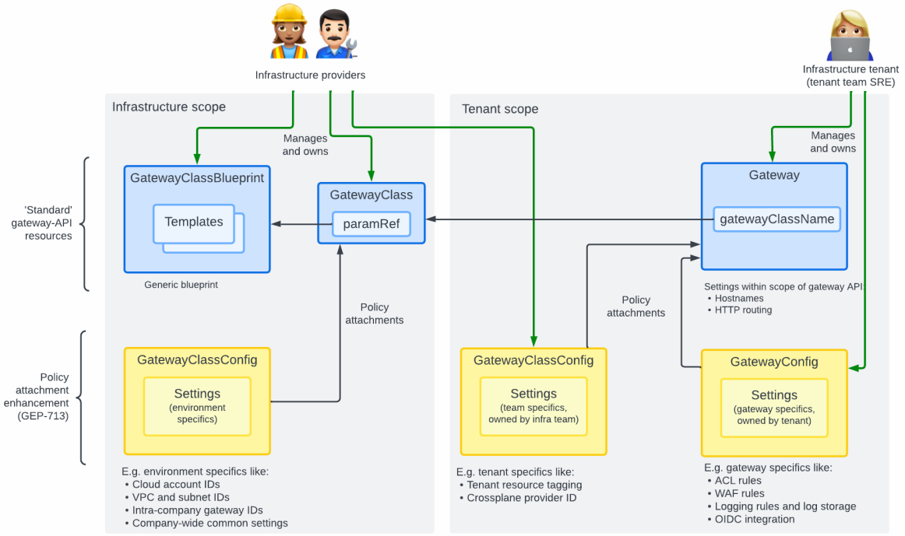
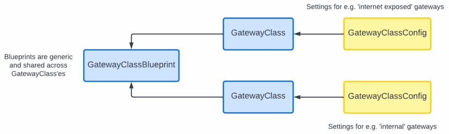

# Extending GatewayClass Definitions using Policy Attachments

This document describes how `GatewayClassBlueprint` associated with a
`GatewayClass` through the parameters reference, can be extended with
additional configuration while still supporting the [role-based model
of the gateway
API](https://gateway-api.sigs.k8s.io/#what-is-the-gateway-api).

Extending GatewayClass definitions follow the Policy Attachment
mechanism described in
[GEP-713](https://gateway-api.sigs.k8s.io/geps/gep-713). This
mechanism describes how CRDs containing extensions outside current
gateway API can be attached to standards-based gateway API and
Kubernetes resources such as namespaces. For our purpose, the
challenges are:

- Keep the role-based model intact while ensuring we cover use-cases
  ranging from environment global settings under infrastructure
  provider control to Gateway specific settings under user/tenant
  control.

- Cover namespaced as well as cluster scoped resources
  (e.g. `GatewayClass`)

- Support precedence of settings as described in
  [GEP-713](https://gateway-api.sigs.k8s.io/geps/gep-713/#hierarchy).

- Cover situations when an infrastructure contains more than one
  `GatewayClass`.

The illustration below shows the three categories of settings we
envision in the role-based model with yellow boxes being *policies*
attached to blue boxed with 'traditional' gateway API resources. The
three groups are:

- Environment global settings under infrastructure provider control.
- Tenant-specific parameters under infrastructure provider control.
- `Gateway` (and potentially `HTTPRoute`) specific settings under
  user/tenant control.

Note, that the illustration shows a policy being attached to a
`Gateway`s resource, but the approach is similar for other gateway API
resources like `HTTPRoute`.

## Policies are Generic Values for Templates in `GatewayClassBlueprint`s

The policy CRDs contain generic values that will be passed to the
templates stored in the `GatewayClassBlueprint` selected by a given
`Gateway` through a `GatewayClass`. Values will be subjected to the
precedence rules defined by GEP-713, but otherwise made directly
available to template rendering through a top-level `.Values` object
(much like Helm charts).

To keep the terminology from GEP-713, we will refer to these generic
values as *policies* even though the scope is broader than merely
*policies*.

Policies will typically be attached to `GatewayClass`es even though
the settings they contain are logically targeted for the
`GatewayClassBlueprint`. This is because we intend to keep the
`GatewayClassBlueprint` generic and the purpose of `GatewayClass` is
to link blueprints with settings and naming the combination. The
illustration below show how a common `GatewayClassBlueprint` is used
together with two `GatewayClassConfig`s to create two
`GatewayClass`es, one for internet exposed traffic and one for
'internal' traffic.

## Using RBAC for Role-based Access

Two different CRDs will be used to effectively attach policies to
gateway resources, namely `GatewayClassConfig` and
`GatewayConfig`. Two CRDs will be used to easily separate access
rights for infrastructure providers and users/tenants.

## Namespaced vs Cluster Scoped Resources

Both `GatewayClassConfig` and `GatewayConfig` CRDs will be
namespaced. For `GatewayConfig` this is obviously because this is used
to configure namespaced `Gateway`s. However, `GatewayClassConfig`s are
namespaced because we need such resources to reference the specific
`GatewayClassBlueprint` which it configures and simultaneously contains
a namespace reference such that different users/tenants can have
configurations for the same `GatewayClassBlueprint`. An example
use-case for this is that infrastructure providers configure the
tagging rules for templated resources such as cloud load-balancers and
the specified tagging will always be applied when a user/tenant
creates a `Gateway` using the specified `GatewayClassBlueprint`.

Hence, when the illustration above shows *tenant scope* it parallels a
Kubernetes namespace, i.e. infrastructure providers create
`GatewayClassConfig` definitions in user/tenant namespaces where
e.g. specific tagging rules are defined.

A special case is namespaced `GatewayClassConfig` definitions in the
*bifrost-gateway-controller* namespace - these are considered as
infrastructure global and applies to `Gateway`s defined in any
namespace.

The *bifrost-gateway-controller* merges values before rendering templates
using the following order of precedence (aka. as *hierarchy* in
GEP-713):

Increasing order of precedence for defaults, decreasing order of
precedence for override's as defined by GEP-713:

- Values from `GatewayClassBlueprint`
- Values from `GatewayClassConfig` in controller namespace (aka. global policies)
- Values from `GatewayClassConfig` in `Gateway`/`HTTPRoute` local namespace targeting namespace
- Values from `GatewayClassConfig` in `Gateway`/`HTTPRoute` local namespace targeting GatewayClass
- Values from `GatewayConfig` in `Gateway`/`HTTPRoute` local namespace, targeting namespace
- Values from `GatewayConfig` in `Gateway`/`HTTPRoute` local namespace, targeting `Gateway`/`HTTPRoute` resource

If there are multiple policies targeting the same resource and setting
the same variable, the result is undefined (see also [Conflict
Resolution](https://gateway-api.sigs.k8s.io/references/policy-attachment/#conflict-resolution)). Policies
of type `GatewayConfig` may target both `Gateway` and `Namespace`
resources.
